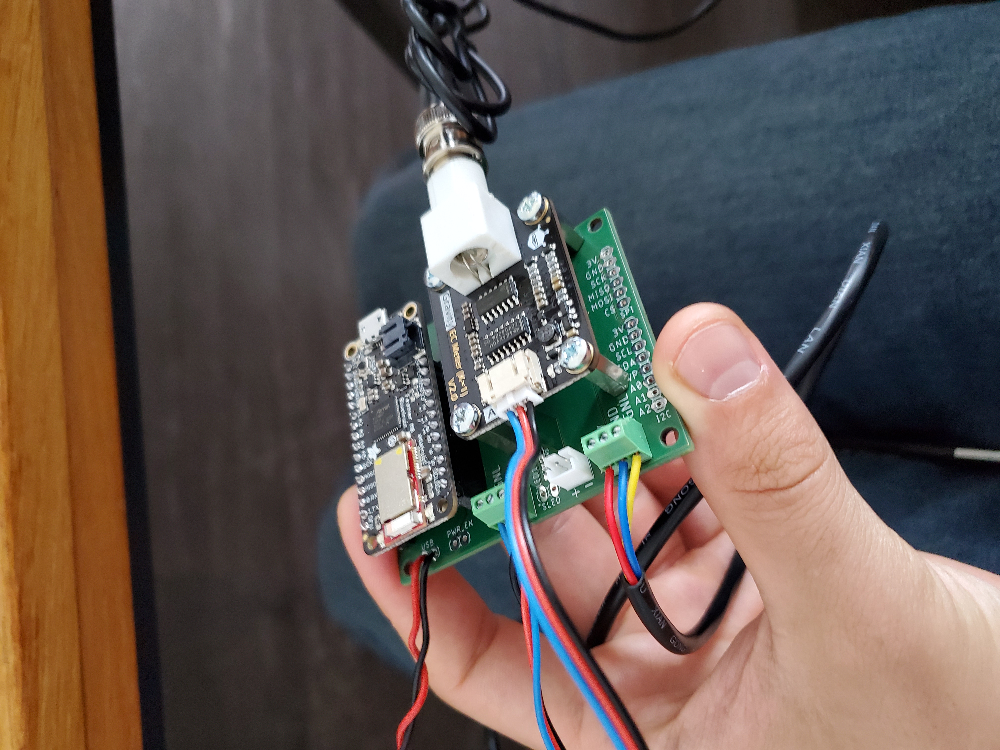

# AquaSense

#### University of Zürich H2K Group and Oregon State University OPEnS Lab 
#### PI: Dr. Jan Seibert &  Dr.Ilja van Meerveld 
###### Team Leads: Kamron Ebrahimi, Jose Manuel Lopez Alcala

## About

AquaSense is a low-cost sensor system capable of measuring electrical conductivity (EC) and relative temperature (RT) of water streams. The device connects via Bluetooth to the AquaSense App, available for Android and iOS, capable of displaying a live feed of collected data and remotely configuring the sampling interval of the device for time series of varying resolutions.

Its primary users are people who are considered “super users” of the CrowdWater platform, a citizen science project sponsored by the University of Zurich intended to collect hydrological data including water level, streamflow, and soil moisture. “Super users” are individuals with more experience with the data collection processes and long term use of the application. These individuals would be sent an AquaSense system that they could use while they are surveying water streams using the CrowdWater application. 

The primary uses are for water hydrological characterization of streams, but it can be used as a teaching tool for emerging hydrology students, as well. As a researcher, having a tool that helps characterize the stream very quickly is extremely beneficial as the hand calculations and lab equipment need for this characterization will be expedited by this instrument. One application, other than EC and RT, is the estimation of water flow based on the concentration of the conductivity over time. This kind of sampling is also crucial characterization for a stream and can be easily estimated using an AquaSense instrument. As a student, this instrument can be beneficial as a way to materialize the theory learned in the classroom. The AquaSense application also aims to have an educational version where only the minimal data is collected for characterization and the calculations are left as an exercise for the student. 
The principle on which AquaSense works is based on electrical conductivity as an indicator of the ion content of the water and thus affecting the water’s ability to conduct an electrical current. An ion’s conductivity is temperature-dependent and for that reason, the system must be calibrated to the temperature of the water that is being sampled or have a temperature sensor that compensates the electrical conductivity readings. AquaSense is equipped with a temperature sensor probe so that users do not have to worry about doing a temperature compensation while in the field. Only a two-point calibration is needed before starting and this is done by putting the probe in two solutions of known conductivity and the system does all the calculations to calibrate the probe to the proper level.
